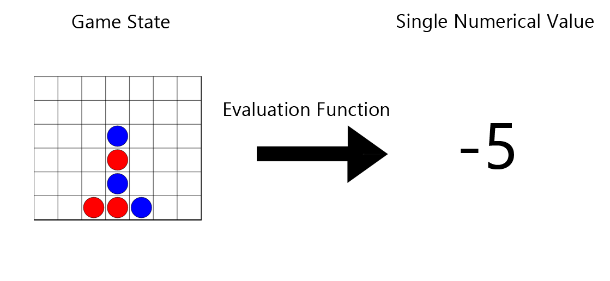
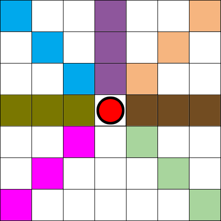
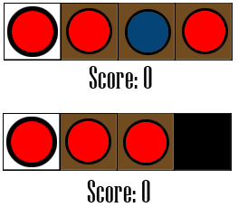
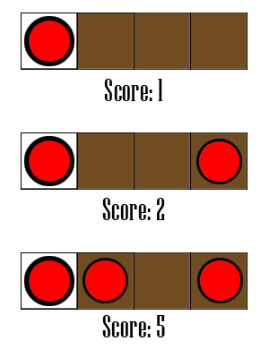

# ConnectFourClone
## Summary
Connect Four CLone is a board game simulation that was written in JavaScript. It uses the p5.js library for the interactive and graphcal elements. An artificial intelligence (AI) was implemented using the minimax algorithm, optimised with alpha-beta pruning.

[Click here to try it out!](https://joelchanzhiyang.github.io/ConnectFourClone/)

## The Goal

This project aims to create a functional Connect Four clone and implement a minimax AI for the game. 

## Minimax Algorithm
### How it works
I learnt the [minimax algorithm](https://en.wikipedia.org/wiki/Minimax) from a video by [Sebastian Lague](https://youtu.be/l-hh51ncgDI) who will be able to explain the algorithm much better than I can.

### Evaluation Function
For a game with a smaller game space (such as tic-tac-toe), the minimax algorithm usually runs until one player has won. However, for Connect Four, the game space is too big and it would take too much time to go through every permutation. Hence, an evaluation function is needed to allow us to compare between game states without actually knowing the outcome. 

A good evaluation function indicate how "good" a game estate is for a certain player. The more accurat the evaluation function, the more likely that the minimax algorithm will pick the most ideal next move for that player. 

### Evaluation Heuristic

A evaluation heuristic needs to balance between computing time and accuracy. 

The heuristic that I have chosen calculates the total number of "four in a row" possible for the red pieces minus the total number of "four in a row" possible for the blue pieces. Paths that have 2 or 3 pieces are given higher weights in order to account for their higher value. 

For each piece, the algorithm searches in 7 directions. There is no need to search below the piece as it is not possible to place a new piece underneath an existing piece.

#### Scoring system

For the sake of demonstration, assume that we are only searching to the right of one particular piece.

1. If the search space contain a different coloured piece or the search space is out of bounds, then a score of **0** is given.

2. If the search space contains only empty spaces or pieces of the same colour, then a score is given based on how many pieces are inside the search space.

## Optimisations
### Alpha-beta Pruning
[Alpha-beta pruning](https://en.wikipedia.org/wiki/Alpha%E2%80%93beta_pruning) works by storing the minimum and maximum values while treversing the game states. With the minimum and maximum values, we do not need to search some parts of the search tree, allowing us to increase the depth of our minimax algorithm without severe performance issues. Once again, the video by [Sebastian Lague](https://youtu.be/l-hh51ncgDI) explains alpha-beta pruning much better.

### Earlier Determination of Winning State
We can determine one move earlier whether the next move will lead to a win by also checking whether there is a token underneath the empty space in the search tree. If there is a token under the empty space and the search space has 3 tokens, then the next move can be a winning move. This method make the search tree more shallow and prevents the AI from missing obvious moves.

### The 